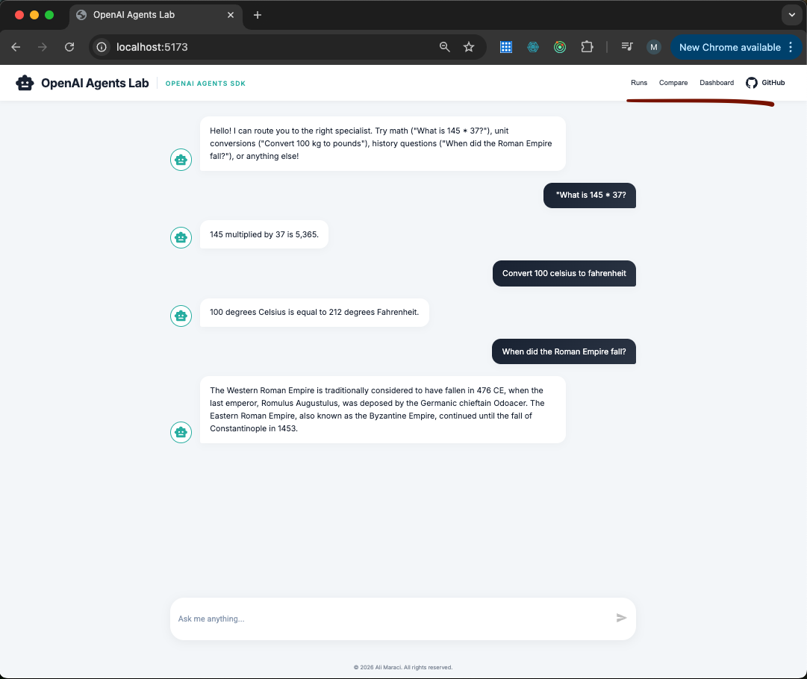
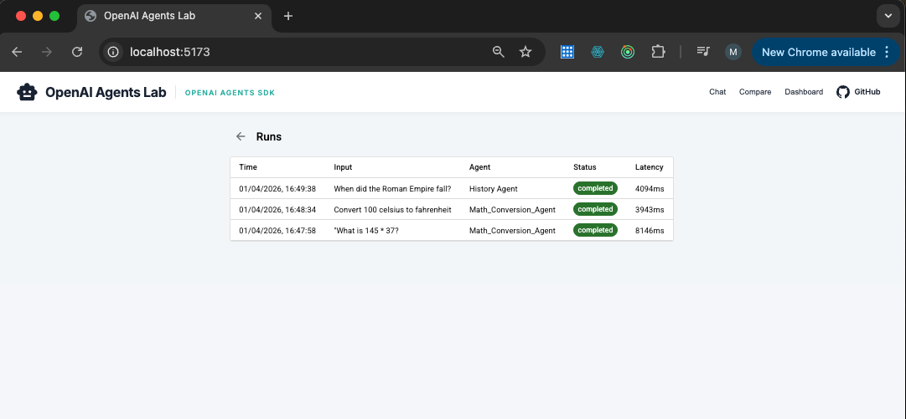
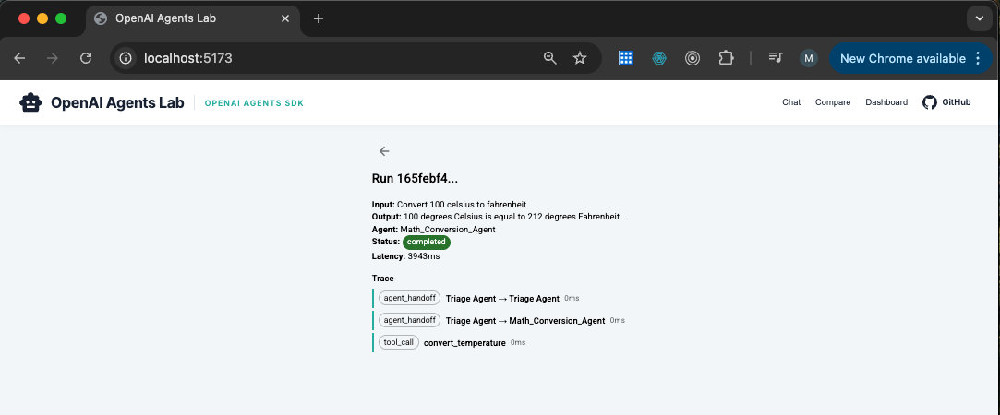
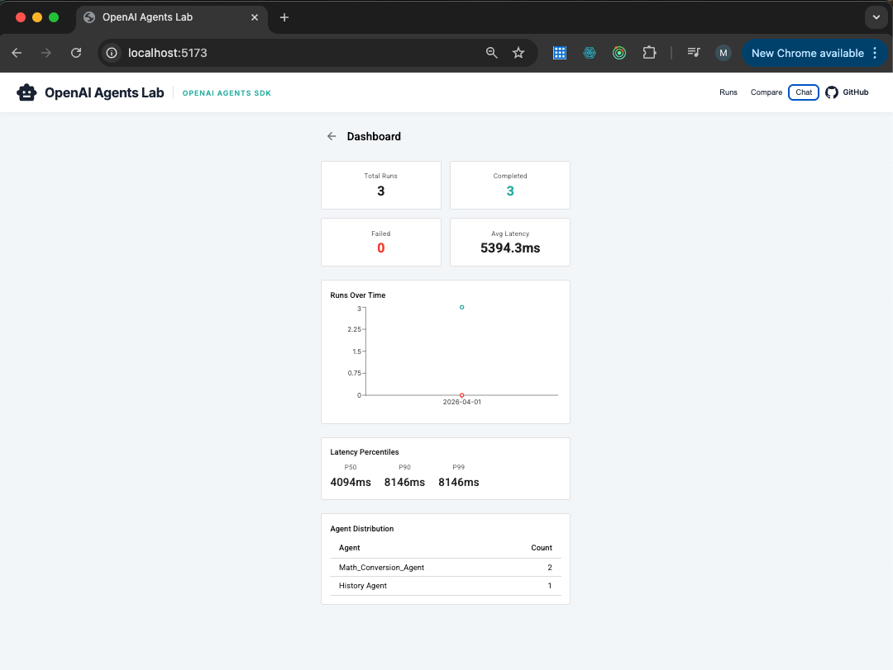

# OpenAI Agents Lab

An eval and observability-first platform built on the [OpenAI Agents SDK](https://github.com/openai/openai-agents-python). Multi-agent orchestration with full tracing, automated benchmarking, experiment comparison, and a monitoring dashboard.



## Features

| Feature | Description |
|---------|-------------|
| **Multi-agent handoffs** | Triage agent routes to Math, History, or General specialist |
| **Function tools** | Calculator and unit converters (temperature, distance, weight) |
| **Guardrails** | Input: prompt injection + content moderation. Output: sensitive data detection |
| **SSE streaming** | Token-by-token response streaming with handoff status updates |
| **Run tracking** | Every chat interaction persisted with status, latency, agent, token counts |
| **Tracing** | Structured spans for agent handoffs, tool calls, and errors |
| **Benchmarks** | JSON dataset system with 19 test cases across 3 datasets |
| **Eval engine** | 5 graders (exact match, agent match, contains, rubric, trajectory) |
| **Experiments** | Compare agent versions with regression detection |
| **Dashboard** | Aggregate metrics, failure tagging, latency percentiles, alerting |
| **92 tests** | Full test coverage across all modules |

## Screenshots

### Runs

View every agent run with routing info, status, and latency. Click any row to inspect the full trace.



### Run Trace

See exactly what happened: agent handoffs, tool calls with inputs/outputs, and timing for each step.



### Dashboard

Monitor agent health: total runs, success/failure rates, latency percentiles, agent distribution, and failure breakdown.



## Architecture

```
Frontend (React + Vite + MUI)                    Backend (FastAPI + OpenAI Agents SDK)
http://localhost:5173                             http://localhost:8000

 Chat ──── POST /api/chat (SSE) ──────────────── Triage Agent ── handoff ── Specialists
 Runs ──── GET /api/runs ─────────────────────── Run & Trace Store (SQLite)
 Compare ─ POST /api/experiments/compare ──────── Eval Runner ── Graders ── Results
 Dashboard GET /api/dashboard/metrics ─────────── Metrics Aggregation ── Alerts
```

### Request Flow

```
User message ── Frontend ── POST /api/chat ── Input Guardrails ── Triage Agent
    ── Handoff to Specialist ── Tool Calls (if needed) ── Output Guardrail
    ── SSE tokens streamed back ── Run + Trace saved to SQLite
```

## Setup

### Prerequisites

- Python 3.10+
- Node.js 18+
- OpenAI API key

### Backend

```bash
cd openai-agents-lab
python -m venv .venv
source .venv/bin/activate
pip install -r requirements.txt
```

Create a `.env` file:

```
OPENAI_API_KEY=your-key-here
```

Start the backend:

```bash
uvicorn app.main:app --reload
```

### Frontend

```bash
cd frontend
npm install
npm run dev
```

Open http://localhost:5173

### Run Tests

```bash
.venv/bin/python -m pytest -v -m "not llm"
```

## Project Structure

```
app/
├── main.py                  # FastAPI app, lifespan, routers
├── config.py                # Settings (DB_PATH, SESSION_EXPIRY_DAYS)
├── database.py              # SQLite schema, run CRUD, session cleanup
├── schemas.py               # Pydantic request/response models
├── agents/
│   ├── definitions.py       # Triage, Math, History, General agents
│   ├── tools.py             # calculate, convert_temperature/distance/weight
│   └── guardrails.py        # Prompt injection, content check, sensitive data
├── api/
│   ├── chat.py              # POST /chat (SSE streaming + run tracking)
│   ├── runs.py              # GET /runs, GET /runs/{id}
│   ├── evals.py             # POST /evals/run, GET /evals/{id}, GET /evals/summary
│   ├── versions.py          # POST /versions, GET /versions
│   ├── experiments.py       # POST /experiments/compare, GET /experiments/{id}
│   └── dashboard.py         # GET /dashboard/metrics, failures, alerts
├── tracing/
│   ├── collector.py         # TraceCollector (handoffs, tool calls, errors)
│   └── store.py             # Persist/retrieve spans from SQLite
├── evals/
│   ├── datasets.py          # Load/validate benchmark JSON files
│   ├── graders.py           # exact_match, agent_match, contains, rubric, trajectory
│   ├── runner.py            # Execute eval runs (agent per case, grade, store)
│   └── store.py             # Eval run + case result persistence
├── experiments/
│   ├── compare.py           # Diff pass rates, detect regressions, per-case diff
│   └── runner.py            # Run baseline vs candidate, store comparison
├── versioning/
│   └── registry.py          # Snapshot agent configs, list/get versions
└── monitoring/
    ├── metrics.py            # Run stats, distributions, percentiles, time-series
    ├── failure_tags.py       # Auto-tag: timeout, looping, schema_error
    └── alerts.py             # Threshold alerts, resolve

frontend/src/
├── App.tsx                   # Chat UI + navigation (Runs, Compare, Dashboard)
├── pages/
│   ├── RunsPage.tsx          # Runs table + trace detail view
│   ├── ComparePage.tsx       # Version management + experiment execution
│   └── DashboardPage.tsx     # Stat cards, charts, failure breakdown, alerts
└── services/
    ├── chatService.ts        # SSE stream consumer
    ├── runsService.ts        # Runs API client
    ├── experimentsService.ts # Versions + experiments API client
    └── dashboardService.ts   # Dashboard metrics API client

benchmarks/
├── tool_routing.json         # 10 cases: does triage route correctly?
├── unit_conversion.json      # 6 cases: do conversions return correct values?
└── general_qa.json           # 3 cases: rubric-graded response quality

tests/                        # 92 tests across all modules
```

## API Reference

### Chat
| Method | Endpoint | Description |
|--------|----------|-------------|
| POST | `/api/chat` | Stream agent response (SSE) |
| GET | `/api/health` | Health check |

### Runs & Tracing
| Method | Endpoint | Description |
|--------|----------|-------------|
| GET | `/api/runs` | List runs (most recent first) |
| GET | `/api/runs/{id}` | Run detail with trace spans |

### Evals
| Method | Endpoint | Description |
|--------|----------|-------------|
| POST | `/api/evals/run` | Start eval run (background) |
| GET | `/api/evals/{id}` | Eval detail with case results |
| GET | `/api/evals/summary` | List eval runs with metrics |
| GET | `/api/evals/datasets` | List available benchmarks |

### Versions & Experiments
| Method | Endpoint | Description |
|--------|----------|-------------|
| POST | `/api/versions` | Snapshot current agent config |
| GET | `/api/versions` | List versions |
| GET | `/api/versions/{id}` | Version detail |
| POST | `/api/experiments/compare` | Start experiment (background) |
| GET | `/api/experiments/{id}` | Experiment results |

### Dashboard
| Method | Endpoint | Description |
|--------|----------|-------------|
| GET | `/api/dashboard/metrics` | Run stats, distributions, percentiles |
| GET | `/api/dashboard/failures` | Failure tag summary |
| GET | `/api/dashboard/alerts` | Active alerts |
| POST | `/api/dashboard/alerts/{id}/resolve` | Resolve an alert |

## Tools

| Tool | Description |
|------|-------------|
| `calculate` | Evaluates math expressions (e.g. `2 + 3 * 4`) |
| `convert_temperature` | Converts between Celsius, Fahrenheit, and Kelvin |
| `convert_distance` | Converts between km, miles, meters, and feet |
| `convert_weight` | Converts between kg, lbs, grams, and ounces |

## Graders

| Grader | Type | Description |
|--------|------|-------------|
| `exact_match` | Sync | Case-insensitive string comparison |
| `agent_match` | Sync | Correct agent routing check |
| `contains` | Sync | Substring match in output |
| `rubric` | Async (LLM) | LLM grades response against a rubric (0.0-1.0) |
| `trajectory` | Async | Validates trace spans match expected step sequence |

## License

MIT
